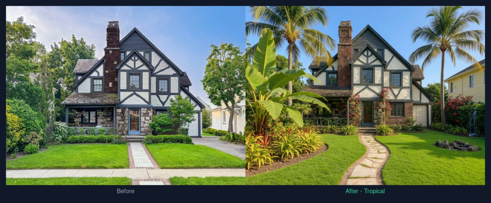

# Greenbloom

> Upload a photo of your yard. Pick a style. Get back an AI-redesigned landscape — house left untouched.

Greenbloom is building the shortest path from a homeowner's yard photo to a built, rebate-funded landscape. Today it handles the design piece — AI image-to-image generation across five curated styles. Next: rebate-eligible plant lists filtered to local programs, documentation generation ready to submit, and a marketplace of vetted contractors who can both build the design and sign off on the paperwork.



## Live demo

**Try it:** <https://greenbloom-ai.vercel.app>

## What it does

1. **Upload** a photo of your front or back yard. Any phone photo works — the client auto-resizes to 1920 px wide before sending.
2. **Pick a style** from five landscape archetypes (Modern, Japanese Zen, Tropical, Mediterranean, Xeriscape / Desert) and optionally add a free-text nudge (e.g., "include a fire pit").
3. **Get a redesign** rendered by an AI image-editing model in roughly 15 seconds — the house, driveway, and property lines stay pixel-faithful to your photo; only the plants, hardscape, and landscape lighting change.

Keep clicking "Try another style" to flip through redesigns on the same photo without re-uploading.

## Tech stack

| Layer | Tool |
| --- | --- |
| Framework | Next.js 14 (App Router + Pages Router hybrid) |
| Language | TypeScript |
| Styling | Tailwind CSS + shadcn/ui |
| Animation | Framer Motion |
| Image model | Nano Banana 2 (Gemini 2.5 Flash Image Edit) via [fal.ai](https://fal.ai) |
| Rate limiting | Upstash Redis + `@upstash/ratelimit` (sliding window) |
| Bot protection | Cloudflare Turnstile |
| Hosting | Vercel |

## Architecture highlights

**Server-side API key isolation.** The fal.ai key never touches the browser. All generation calls go through `/api/generate`, which holds the credential and proxies fal.

**Layered abuse prevention.** A public demo with a paid AI backend is an open invoice waiting to be cashed. Three layers cap exposure:

- **Cloudflare Turnstile** blocks scripted clients before they can hit the model.
- **Per-IP rate limit** (5 generations / hour) protects against a single attacker grinding through credits.
- **Site-wide global limit** (100 generations / day) is the last line of defense against distributed botnets — it caps worst-case daily fal spend below $6 (100 × $0.06 per image).

Rate limiting auto-disables in development (`NODE_ENV !== "production"`) so local iteration isn't throttled.

**Prompt engineering for image-to-image fidelity.** Image-edit models at high prompt adherence happily redesign the house along with the landscape unless explicitly held back. Each style prompt is structured as a **sandwich**: a strong architectural preservation clause (listing windows, siding, paint, roof, trim, doors, etc.) wraps both the opening *and* closing of the prompt, so the model gets the "don't touch the house" signal in both high-weight positions. The creative hero description, user-requested elements, and anti-cliché guardrails live in the middle. Model selection went through side-by-side testing — FLUX.1 Kontext, FLUX.2 Pro, and Nano Banana 2 all generated against the same prompt sandwich; Nano Banana 2 won on instruction-following (e.g., actually renders a cascading waterfall when asked, rather than substituting a bird bath).

**Client-side image resize.** The browser decodes the uploaded file into a canvas, scales it so the longest side is ≤ 1920 px, and re-encodes as JPEG at quality 0.85 before sending. This handles multi-MB phone photos cleanly, keeps the eventual payload well under Vercel's 4.5 MB serverless body cap, and strips EXIF (including GPS) as a privacy side-benefit.

**Honest UX over knobs.** An early version exposed a "How dramatic?" guidance slider. Testing showed users always pushed it to max, so the knob was removed and the backend leans on prompt structure (not parameters) to shape output.

**Match-input lighting.** Earlier outputs defaulted to golden-hour cinematic lighting, which looked great in isolation but broke tonal consistency with midday upload photos. Prompts now explicitly ask the model to match the input photo's lighting, exposure, and time of day — cleaner before/after comparisons at the cost of some drama.

## Local development

You'll need Node 20+ and a free fal.ai account.

```bash
git clone https://github.com/niveditapatil/greenbloom.git
cd greenbloom
npm install
cp .env.example .env.local
# Then edit .env.local and paste a FAL_KEY from https://fal.ai/dashboard/keys
npm run dev
```

Open <http://localhost:3000>.

In dev, Upstash and Turnstile are optional — leave their env vars blank and the app skips both. For production both are recommended (see `.env.example`).

## Deploying to Vercel

1. Push this repo to GitHub.
2. Import it on [vercel.com/new](https://vercel.com/new).
3. Add the environment variables from `.env.example` to the Vercel project (`FAL_KEY` is required; the Upstash and Turnstile pairs are strongly recommended for prod).
4. Deploy. Add the production hostname to your Turnstile widget's allowlist on the Cloudflare dashboard.

## Roadmap

The current UI surfaces these as "coming soon" cards on the landing page:

- **Rebate matching** — enter your zip code, get told which local water-conservation rebates your design qualifies for, and generate the paperwork ready to submit.
- **Contractor marketplace** — connect with vetted local landscapers who can both build the design and sign off on rebate documentation.
- **Regional plant palettes** — filter plant choices to species that survive in your USDA zone and comply with your local rebate program's approved list.
- **User accounts** — save designs to a personal gallery, share with others, revisit across sessions.

## License

MIT — see [LICENSE](LICENSE).
